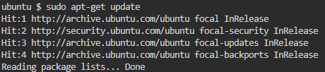
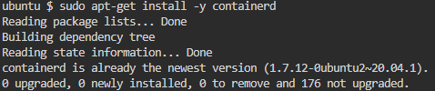
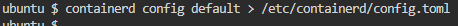

# Praktikkan Menggunakan Containerd

## Instalasi containerd

1. Menggunakan ubuntu: 
  - **sudo apt-get update**

    

  - **sudo apt-get install -y containerd**

    

2. Konfigurasi containerd
   - Untuk membuat konfigurasi default, jalankan
  
      
