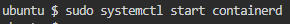
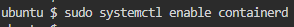
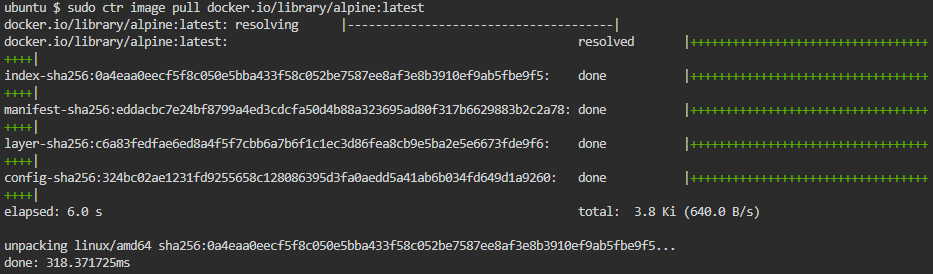
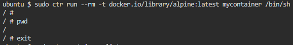
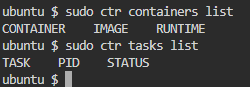

# Praktikkan Menggunakan Containerd

## Langkah-Langkah Praktikum Containerd

1. Instalasi containerd:
   **Di Ubuntu/Debian:**
   - sudo apt-get update

       

   - sudo apt-get install -y containerd

       

3. Konfigurasi containerd
   **Untuk membuat konfigurasi default, jalankan**
   
   - containerd config default > /etc/containerd/config.toml

       

5. Mulai dan Aktifkan containerd
   **Jalankan dan aktifkan layanan containerd:**
   - sudo systemctl start containerd
  
       
     
   - sudo systemctl enable containerd

     

6. Menjalankan dan Mengelola Container
   **Gunakan perintah ctr untuk menarik image dari Docker Hub sebelum menjalankannya**
   - sudo ctr image pull docker.io/library/alpine:latest

     

   **Setelah image berhasil di-pull, coba jalankan container kembali:**
   - sudo ctr run --rm -t docker.io/library/alpine:latest mycontainer /bin/sh

     

7. Verifikasi Containerd
   **Untuk memeriksa status containerd dan container yang berjalan**
   - sudo ctr containers list dan sudo ctr tasks list

     
